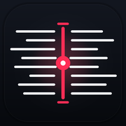
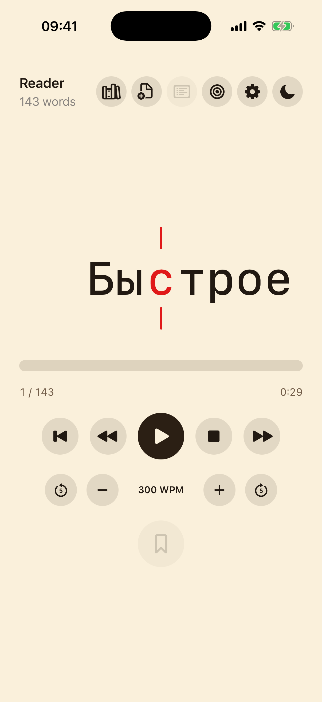

<div align="center">
  

# Reader

**A native SwiftUI RSVP reader for focused, distraction-free reading on iPhone.**


<br>


</div>

## Features

- **RSVP playback** — centered Optimal Recognition Point highlighting with
  play, pause, resume, stop, restart, stepping, and speed controls.
- **Add books** — import text-based PDF and EPUB files directly from the native
  document picker.
- **Library** — keep multiple books locally with independent position, progress,
  settings, and last-opened state.
- **Bookmarks** — save positions per book, jump back instantly, and delete with
  swipe or long-press actions.
- **Save and resume** — reopen the most recently used book at its persisted
  reading position.
- **Reading controls** — adjust WPM, fades, punctuation pauses, long-word timing,
  periodic pauses, and multi-word frames.
- **Native experience** — warm light and dark themes, Reduce Motion support,
  lifecycle-aware pausing, VoiceOver labels, and hardware keyboard shortcuts.

## Supported Content

| Format | Support |
| --- | --- |
| PDF | Text extraction through PDFKit |
| EPUB | ZIP archives and Apple Books directory packages |
| EPUB structure | OPF spine order, readable XHTML, percent-escaped resources |

Every successful import becomes a local library book and opens immediately.
Scanned PDFs and image-only documents require OCR, which Reader does not
currently provide.

## Safety Limits

Reader treats imported documents as untrusted input. Processing is bounded by:

- document and EPUB resource byte limits;
- PDF page and EPUB spine-item limits;
- extracted-character and XHTML text-segment limits;
- token-count, token-byte, and token-character limits.

Documents that exceed a limit fail safely without replacing the active book.
Encrypted, malformed, or unsupported packages are rejected with a visible
import error.

## Architecture

```text
Reader/
├── App/                  SwiftUI screens and application wiring
├── Domain/               ReaderCore package: parsing, timing, import, storage
└── Assets.xcassets/      App icon and color assets

ReaderCoreTests/          Domain and source-level regression coverage
ReaderTests/              Xcode application tests
ReaderUITests/            Simulator UI tests
openspec/                 Capability specs and change artifacts
```

Business logic stays in `Reader/Domain/` so parsing, timing, persistence, and
document import behavior can be tested independently from SwiftUI.

## Requirements

- Xcode 26.5 or newer
- iOS 17.0 or newer
- Swift Package Manager access to
  [`ZIPFoundation`](https://github.com/weichsel/ZIPFoundation)

The application bundle identifier is `com.sigius.reader`. Local development
signing is configured in the project; distribution requires signing assets and
export options valid for the releasing Apple Developer account.

## Build and Test

Run the `ReaderCore` package tests:

```sh
swift test
```

Run the app, unit, and UI suites:

```sh
xcodebuild -scheme Reader \
  -destination 'platform=iOS Simulator,name=iPhone 17' \
  -parallel-testing-enabled NO \
  test
```

Build for the simulator:

```sh
xcodebuild -scheme Reader \
  -destination 'platform=iOS Simulator,name=iPhone 17' \
  -derivedDataPath /tmp/ReaderSimulatorBuild \
  build
```

Create an unsigned archive:

```sh
xcodebuild -scheme Reader \
  -destination 'generic/platform=iOS' \
  -archivePath /tmp/Reader.xcarchive \
  CODE_SIGNING_ALLOWED=NO \
  archive
```

## Documentation

- [`docs/ios-rsvp-reader-acceptance.md`](docs/ios-rsvp-reader-acceptance.md) —
  implemented scope, limitations, verification, and smoke checks.
- [`docs/epub-import-evaluation.md`](docs/epub-import-evaluation.md) — EPUB
  extraction boundary and dependency decision.
- [`openspec/specs/`](openspec/specs/) — canonical capability specifications.
- [`AGENTS.md`](AGENTS.md) — repository-specific development rules.

## Limitations

Reader does not currently include OCR, annotations, folders, tags, library
search, table-of-contents navigation, cloud sync, or App Store release metadata.

## License

Reader is available under the [MIT License](LICENSE).
